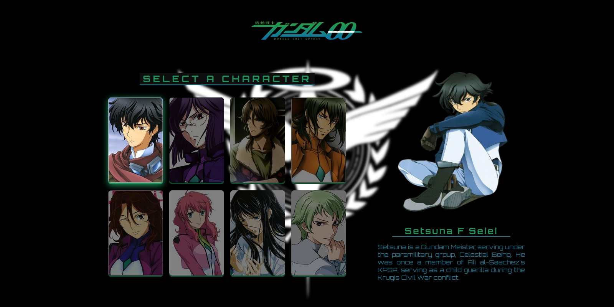

# DEV EM DOBRO - Interactive X-MEN Page

This is my project inspired on the X-MEN page built during a event week with [DEV EM DOBRO](https://devemdobro.com/matriculas-abertas/), which helped me improve my coding skills by building realistic projects.

## Table of contents

- [Overview](#overview)
  - [The challenge](#the-challenge)
  - [Screenshot](#screenshot)
  - [Links](#links)
  - [Built with](#built-with)
- [Author](#author)

## Overview

### The challenge

Users should be able to:

- View the optimal layout for the app depending on their device's screen size
- See hover states for all interactive elements on the page
- See each character and the related description

### Screenshot

### Links

- Code URL: https://github.com/tabascum/mobile-suit-gundam-00
- Live Site URL: https://tabascum-gundam-00.netlify.app/

### Built with

- Semantic HTML5 markup
- CSS custom properties
- Flexbox
- CSS Grid
- Mobile-first workflow

## Author

- Vasco Marques - https://github.com/tabascum
